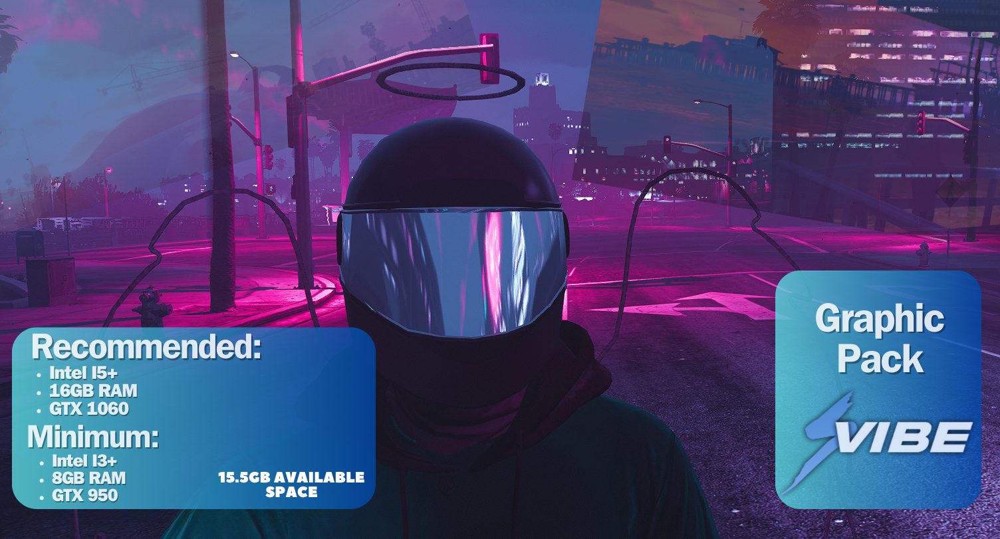
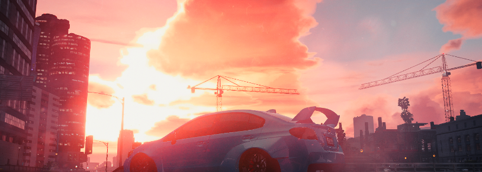

# Graphics

FiveM Graphics Made By (Jakiś random) Re-Work (DrQWerciak)

- :gear:・Join My Discord And Open Ticket To Ask Support or Give Me Suggestions Or Report A Bug

`My Discord`

- [Discord](https://discord.gg/seavibe)

```
  🎅🎃🍁Next Updates January🍁🎃🎅
```

- Better Water
- Better Rain
- Better Colors
- Better Reflections
- Better Clouds
- Better Nights
- Better Sky
- Better Fire
- Better StreetLights
- FPS Increase

```
   Things To (Fix/Add)
```

- Random Bloom On Police Vehicles (Fix)
- Raindrops on Vehicles (Fix)
- Dirty Water (Fix)
- Better Fog (Add)
- Rain Puddles (Add)
- Better Roads/Dirt/Grass (Add)
- Better Vegetation (Add)
- Better Texture Mix (Add)
- Better Shadows (Add)
- Retexture More Then 35+ Buildings (Add/Goal) --Goal Is To Retexture Alot Of Buildings

## (Requirement Specs)



## PLEASE MAKE SURE YOU ARE DO ALL THE STEPS! (Requirement)

Okay So Go To Your FiveM Files `/FiveM.app\citizen` And Replace Every File In `Citizen`

Okay So Go To Your OpenIV And Drag Everything In `(Drag This Files In The Gta5 Mods Folder)`

- Using OpenlV install FSGraphics.oiv package (Not Done Yet)
- Run And Install Reshade

## SHOWCASE

_{ReshadeMe preset Is On My Server}_




## Installation For SoundPack

Okay So Go To Your GTAV Files `GrandTheftAutoV\x64\audio\sfx` And Replace Every File In `sfx`

## Here Is The Download For The SoundPack Cuz Is Too Big For Github

- [download](https://www.mediafire.com/file/vlhgr919ptod4s2/SoundPack.rar/file)


## ServerSide Graphics

Simple Graphics quick Drag And Drop And Run

# Known Bug That Happen ClientSide

Random Bloom (Client)
Random Road Texture Loss (Client)
Random Water Texture Loss (Client)

## Useful Information

- Okay Now IF The Graphics Break For Any Reason Make Sure To Delete The File `content_index` Now This Will Reset Your `Citizen` Files Back To Normal
- Okay Now IF The Audio Break For Any Reason Make Sure To Drag Your Files In The `ArchiveFix.exe`
- Make Sure You Dont Have Any Other Graphics Pack As I Havent Try Messing With Other Graphics Pack
- Uninstall: Delete mods folder, `dxgi.dll` and `d3d11.dll`

## Neccesary files links:

- [OpenlV](https://discord.com/channels/869166393470357535/1052957487160103042)
- [Winrar](https://www.win-rar.com/start.html?&L=0)

## Disclaimer

- Please reupload <3

## Remember If You :star2:Star This Repository It Will Keep You Notify For Future Updates

- :black_heart:Thank You For Downloading SeaVibe-GRAPHICS:black_heart:
